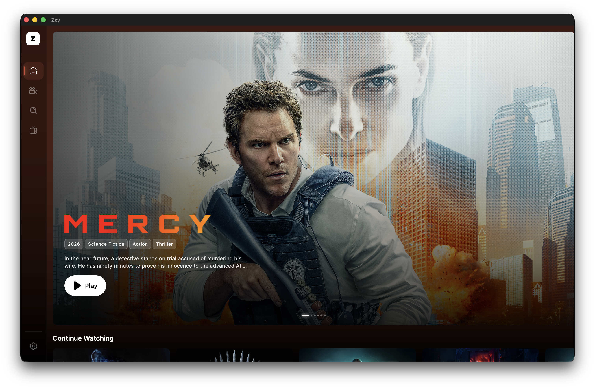
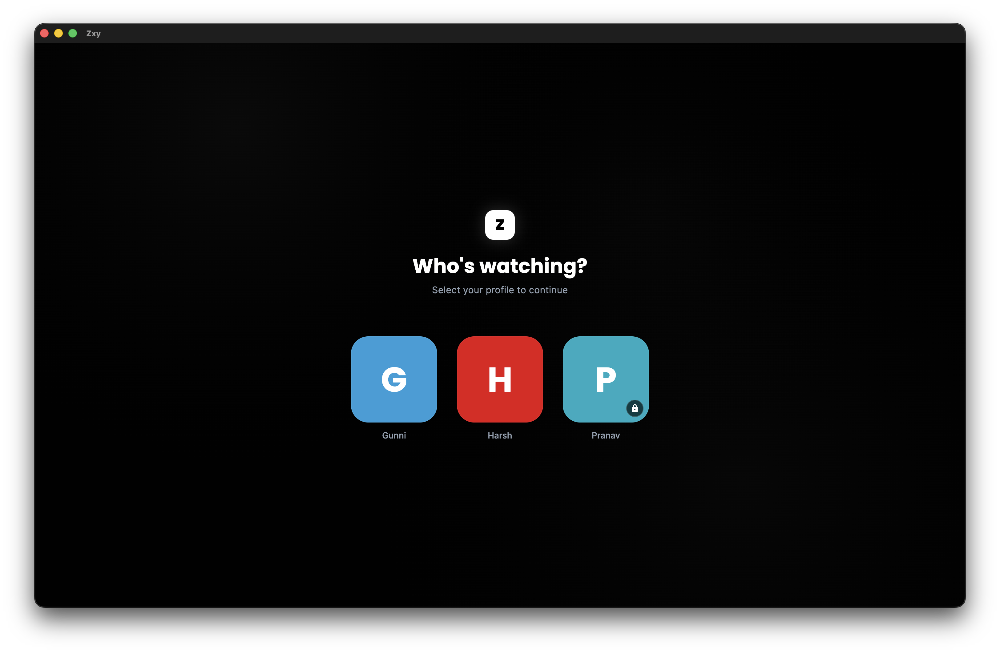
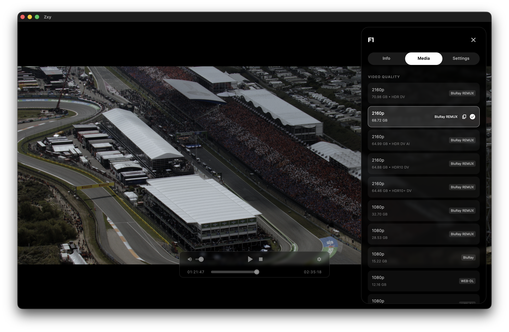
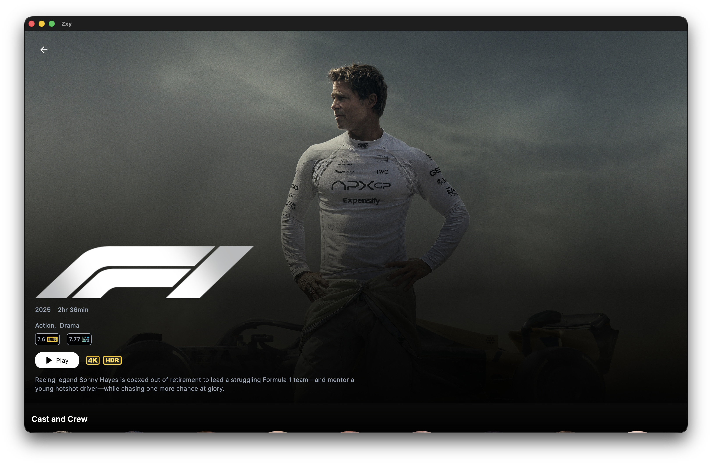
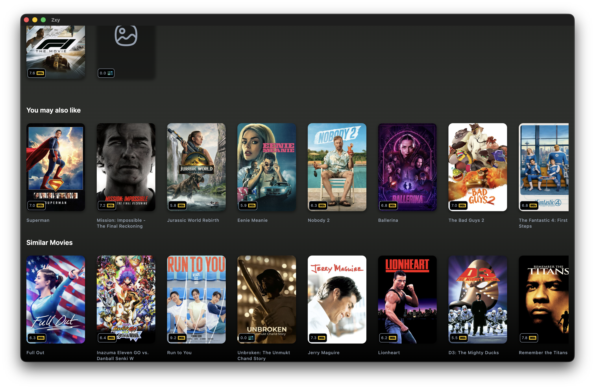
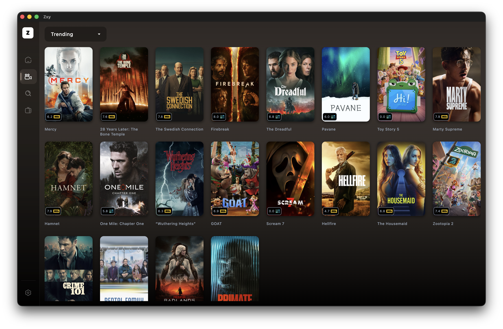

# zxy 🎬

**zxy** is a minimalist, high-performance media streaming application built with Flutter. Designed for a "plug and play" experience, zxy removes the friction of complex configurations, letting you get straight to your content.

---

## ✨ Features

* **Zero Configuration:** No complex setup or technical tweaking required. Just log in and go.
* **Hybrid Provider Support:** Native, out-of-the-box integration with **Real-Debrid** and **TorBox**.
* **Multi-Profile Support:** Switch between user profiles instantly—no extra setup needed.
* **Simple UI:** A clean, distraction-free interface focused on usability.
* **Flutter Powered:** Smooth animations and fast performance across supported platforms.

---

## 📱 Interface Preview

### Home Dashboard
*Clean, minimalist UI with zero configuration required.*

### Profile Management & Provider Integration
*Native support for multiple profiles and out-of-the-box Real-Debrid/TorBox integration.*

### Player
*Powered using MPV*

---

## 🚀 Getting Started

### Download & Install

1.  Navigate to the [**Releases**](https://github.com/hhacker1999/zxy/releases) page.
2.  Download the latest version for your device (windows and macos supported for now).
3.  Install the application and sign up and add your debrid key in settings

### Requirements
* A valid **Real-Debrid** or **TorBox** account.
* An active internet connection.

---

## 🛠️ Built With

* [Flutter](https://flutter.dev/) - UI Framework.
* [Media Kit](https://github.com/media-kit/media-kit) - Media kit used as MPV based player

---

## 📡 Data & Attributions

This application uses *TMDB* and the *TMDB APIs* but is not endorsed, certified, or otherwise approved by *TMDB*.

---
*Created with ❤️ for a better streaming experience.*
